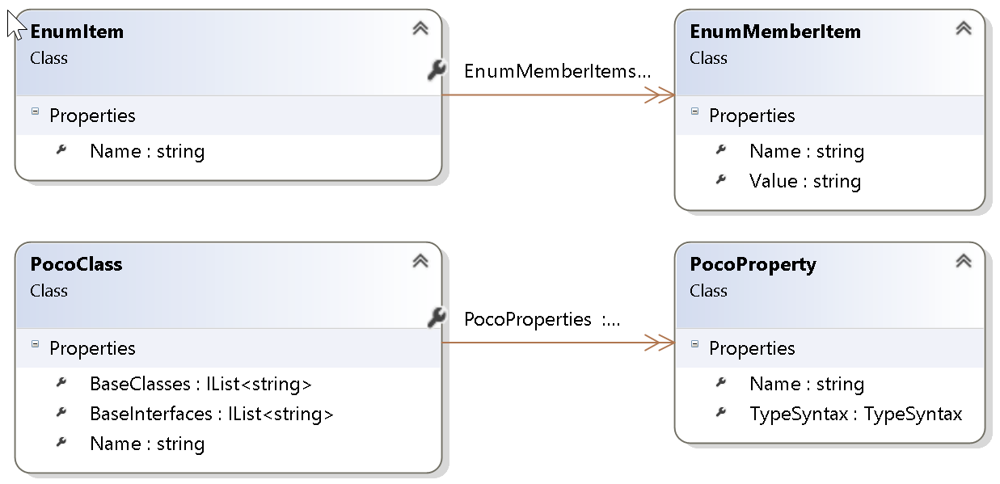

#  TeaForPoco
T4 Template Generation for C# Poco Files

## The Problem

You have to develop a single page application and you would like to use typescript.
These days most WebApplications receive their data from a restful api from the server.
Hence you will get plain json content.
If you work with C# on the server you typically have Pocos (Plain old CLR Objects),
that you use as Dtos (Data transfer Objects).
These Pocos are well typed of course, but on the way to the client you loose this
typing. In case of using simple javascript you will not be worried about that.
But if you use typescript on the client it would be nice to have well generated
typescript interfaces for accessing your plain json objects.
You could implement these interface on your own, but this is a lot of work
and error prone.

With **TeaForPoco** you can automatically generate typescript model and enum classes and other useful files for your purpose.

## Advantages of T4 Templates
- T4 Templates are fully integrated in Visual Studio.
- Easy installation, as you just need to copy some files into your project.
- It does not pollute your own project.
- You can modify or extend the templates for your own purposes.
- Available Visual Studio Plugins for T4 Template development (e.g. *[T4 Editor from Devart](https://www.devart.com/t4-editor/)*, Resharper Plugin *[TeaFor](https://resharper-plugins.jetbrains.com/packages/ForTea/)* )
- Automatically regenarate on build

## Content

**TeaForPoco** consists of two parts:

- The core file (*\TeaForPoco.Core.ttinclude*) with plain C# code to read your Poco Files 
- The T4 template files (*\Typescript\enums.tt*,*\Typescript\models.tt*, ...) that generates the output.

## Installation

### Install Sample Project 
1. Clone the project
2. Open the Visual Studio Solution file (*TeaForPoco.sln*)
3. Restore nuget packages for the project (right click on project and select Manage NuGet Packages...)
4. Run T4 Template generation (e.g. from VS menu: Build->Transform All T4 Templates)
5. Check the generated files for the Sample Poco Files in SampleDto and SampleEnum folder.
 (*[\Typescript\enums.tt.generated.ts](https://github.com/SoftwareWizard/TeaForPoco/blob/master/docs/images/enums.generated.ts.png)*, *[\Typescript\models.tt.generated.ts](https://github.com/SoftwareWizard/TeaForPoco/blob/master/docs/images/models.generated.ts.png)*)

### Use it in your own Project

1. Copy the core file and T4 template files to your project wherever you need it.
2. Optionally rename the T4 template files for your needs.
3. Add missing NuGet Packages. (see Dependencies section)
4. Check include path for NuGet Packages in core file.
4. Set the reference path to the core file in your T4 template files. (see configuration section)
5. Adapt configuration parameters in T4 template files. (see configuration section)
6. Optionally add *.generated.ts to your .gitignore file.

## Dependencies

**TeaForPoco** needs the following NuGet Packages

- Microsoft.CodeAnalysis
- Microsoft.CodeAnalysis.CSharp

The core file needs to include these files from the nuget package folder

`<#@ assembly name="$(SolutionDir)\packages\Microsoft.CodeAnalysis.Common.1.3.2\lib\net45\Microsoft.CodeAnalysis.dll" #>`   
`<#@ assembly name="$(SolutionDir)\packages\Microsoft.CodeAnalysis.CSharp.1.3.2\lib\net45\Microsoft.CodeAnalysis.CSharp.dll" #>`   

## Configuration

### Reference to .ttinclude file

The first line in the T4 Template references the core file.
`<#@ include file="TeaForPoco.Core.ttinclude" #>`   
Adapt the path correctly, for example 
`<#@ include file="$(SolutionDir)\MyProject\Resources\TeaForPoco.Core.ttinclude" #>`

### Settings

Each T4 Template file has a *settings* section with parameters.

##### enums.tt

- EnumPath -> Path to your enumeration files.
- EnumModuleName -> Name of the typescript module name.

##### models.tt

- EnumPath -> Path to your enumeration files.
- EnumModuleName -> Name of the typescript module name for enums  
  (should match with the one in enums.tt)
- PocoClassPath -> Path to your poco files.
- PocoClassFilenameSuffix -> Suffix of your Poco Files  
  (if you have one, otherwise all files in source folder are regarded as Poco files)
- PocoClassSuffix -> Suffix of your Poco Classes   
  (if you have one and likes to remove it)
- RemoveClassSuffix -> true/false, removes Class Suffix
- InterfaceModuleName -> Name of the typescript module name for typescript interfaces
- CustomPlurals -> Dictionary for Custom pluralisation   
  (only necessary if RemoveClassSuffix is true)

----

## Typescript Mapping

### Value Types

You can adapt the mapping in models.tt within the *Static Declarations* section

| C#            | Typescript  |
| ------------- |:-----------:|
| string        | text        |
| int           | number      |
| double        | number      |
| bool          | boolean     |
| DateTime      | Date        |

**Please add more if you need it!**

### Reference Types

Reference Types will be provided by your Poco Classes or Enums you provide.  
If the template could not resolve a type, you will get a warning.

### Array Types

Array Types in C# are mapped to corresponding Array Types in Typescript. 

### Generic Types

Generic Types can be nested.

#### Collection Types

Generic Collection Types in C# are mapped to Arrays in Typescript.   
These types are configured in models.tt in the *Static Declarations* section and are the following:
- Collection
- List
- Array
- Enumerable

**Please add more if you need it!**

#### Dictionary Types

Generic Dictionary Types in C# are mapped to nested Arrays in Typescript.   
These types are configured in models.tt in the *Static Declarations* section and are the following:
- Dictionary

**Please add more if you need it!**

### Nullable Types

Nullable types in C# are directly mapped to a non-nullable typescript type, because all types in typescript are nullable.   
(It is not mapped to optional types, marked with "?")

----
# Extensibility

You can also write your own T4 templates and generate individual output,
by using the *TeaForPoco.Core.ttinclude* file.

### TeaForPoco.Core.ttinclude

#### Basic functionality

#### Output Class Diagram

#####  EnumItem Class

- Name -> Name of the enumeration.
- EnumMemberItems -> List of EnumMemberItem objects.

#####  EnumMemberItem Class

- Name -> Name of the enumeration item.
- Value -> Value of the enumeration item  .
  (if it has a value assigned)

#####  PocoClass Class

- Name -> Name of the poco class.
- BaseClasses -> List of base classes the poco inherits.
- BaseInterfaces -> List of interfaces the poco implements.
- PocoProperties -> List of PocoProperty objects.

#####  PocoProperty Class

- Name -> Name of the property
- TypeSyntax -> TypeSyntax Object (used from Roselyn)

---
# Links

 [MSDN (T4)](https://msdn.microsoft.com/en-us/library/bb126445.aspx)   
 [Wikipedia](https://en.wikipedia.org/wiki/Text_Template_Transformation_Toolkit)   
 [T4 Template Tutorials and Solutions](http://t4-editor.tangible-engineering.com/How-Do-I-With-T4-Editor-Text-Templates.html)   
 [Pluralsight Course (T4)](https://www.google.ch/url?sa=t&rct=j&q=&esrc=s&source=web&cd=1&cad=rja&uact=8&ved=0ahUKEwiNir60xYzRAhUD6CwKHQdSA8sQFggaMAA&url=https%3A%2F%2Fwww.pluralsight.com%2Fcourses%2Ft4-templates&usg=AFQjCNG4s8OCMFP1bfkSqOIi8S1YL9cwBw&bvm=bv.142059868,d.bGg)